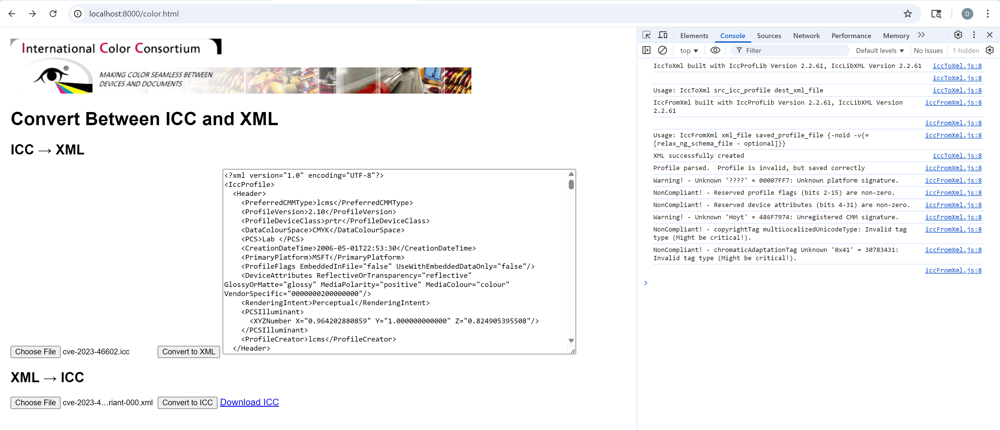

# WASM Preview

**Last Updated** 28-July-2025 at 1800Z by David Hoyt

The WebAssembly build (iccWASM) wraps the iccDEV Command Line Tools in JavaScript enabling color profile development using modern web browsers. The `.wasm` & `.js` files are available in [WASM Tools](https://github.com/InternationalColorConsortium/DemoIccMAX/tree/research/contrib/Build/cmake/cov/wasm/Tools) directory, run using `python3 -m http.server`.

## WASM Status
1. iccToXml & iccFromXml
[](https://color.org)

2. iccRoundTrip
[](https://color.org)

3. iccDumpProfile
[](https://color.org)


---

## WASM Build

The build instructions for `iccdev` for WASM are a work in progress.

## Build Reproduction

1. LibXML2 for WASM

```
cd Build/
git clone https://gitlab.gnome.org/GNOME/libxml2.git
cd libxml2

emconfigure ./autogen.sh --without-python --host=wasm32-unknown-emscripten --prefix=$(pwd)/out
emmake make -j$(nproc)
emmake make install
```

2. Build other 3rd party deps

`bash third_party_wasm_build.sh`

3. Install JSON Headers

`sudo apt install nlohmann-json3-dev`

4. Configure & Build `iccmax` for WASM

**Modified CMakeLists.txt to build Libs only**

```
cd DemoIccMAX/Build
emcmake cmake Cmake/ \
  -DCMAKE_BUILD_TYPE=Release \
  -DENABLE_TOOLS=ON \
  -DENABLE_STATIC_LIBS=ON \
  -DLIBXML2_INCLUDE_DIR=$(pwd)/libxml2/out/include/libxml2 \
  -DLIBXML2_LIBRARY=$(pwd)/libxml2/out/lib/libxml2.a \
  -DTIFF_INCLUDE_DIR=$(pwd)/libtiff/out/include \
  -DTIFF_LIBRARY=$(pwd)/libtiff/out/lib/libtiff.a \
  -DJPEG_INCLUDE_DIR=$(pwd)/third_party/libjpeg/out/include \
  -DJPEG_LIBRARY=$(pwd)/third_party/libjpeg/out/lib/libjpeg.a \
  -DCMAKE_CXX_FLAGS="-I$(pwd)/libtiff/out/include -I$(pwd)/third_party/libjpeg/out/include" \
  -DCMAKE_EXE_LINKER_FLAGS="\
    -s INITIAL_MEMORY=128MB \
    -s ALLOW_MEMORY_GROWTH=1 \
    -s FORCE_FILESYSTEM=1 \
    -s MODULARIZE=1 \
    -s EXPORT_NAME=createModule \
    -s EXPORTED_RUNTIME_METHODS=['FS','callMain']" \
  -Wno-dev
emmake make -j$(nproc)
```

4. Check for WASM

**IccProfLib**

```
wasm-objdump -x IccApplyBPC.cpp.o | head
IccApplyBPC.cpp.o:      file format wasm 0x1
Section Details:
Type[13]:
 - type[0] (i32) -> i32
 - type[1] (i32, i32, i32) -> nil
 - type[2] (i32) -> nil
 - type[3] (i32, i32, i32, i32, i32, i32) -> f32
```

**IccXML**

```
wasm-objdump -x IccIoXml.cpp.o | head
IccIoXml.cpp.o: file format wasm 0x1
Section Details:
Type[4]:
 - type[0] (i32, i32, i32) -> i32
 - type[1] (i32) -> i32
 - type[2] (i32) -> nil
 - type[3] (i32, i32) -> i32
```

5. Test cpp

```
#include <iostream>

// Forward declarations (match the linked .a exactly)
class CIccProfile;
class CIccXform;

class CIccApplyBPC {
public:
  // Correct signature as per llvm-nm output
  int CalcFactors(const CIccProfile*, const CIccXform*, float*, float*) const;
};

int main() {
  std::cout << "WASM Static Link Test Begin\n";

  CIccApplyBPC bpc;
  int result = bpc.CalcFactors(nullptr, nullptr, nullptr, nullptr);

  std::cout << "CalcFactors returned: " << result << "\n";
  std::cout << "WASM Static Link Test Passed\n";

  return 0;
}
```

6. Compile Test cpp

```
em++ test_link.cpp \
  ./IccProfLib/libIccProfLib2.a \
  -o test_link.js \
  -s WASM=1 -s EXIT_RUNTIME=1 -s ENVIRONMENT=node \
  -I./libxml2/out/include/libxml2 \
  -std=c++17
```

7. Validate

`node test_link.js`

8. Expected Output

```
WASM Static Link Test Begin
CalcFactors returned: 0
WASM Static Link Test Passed
```

